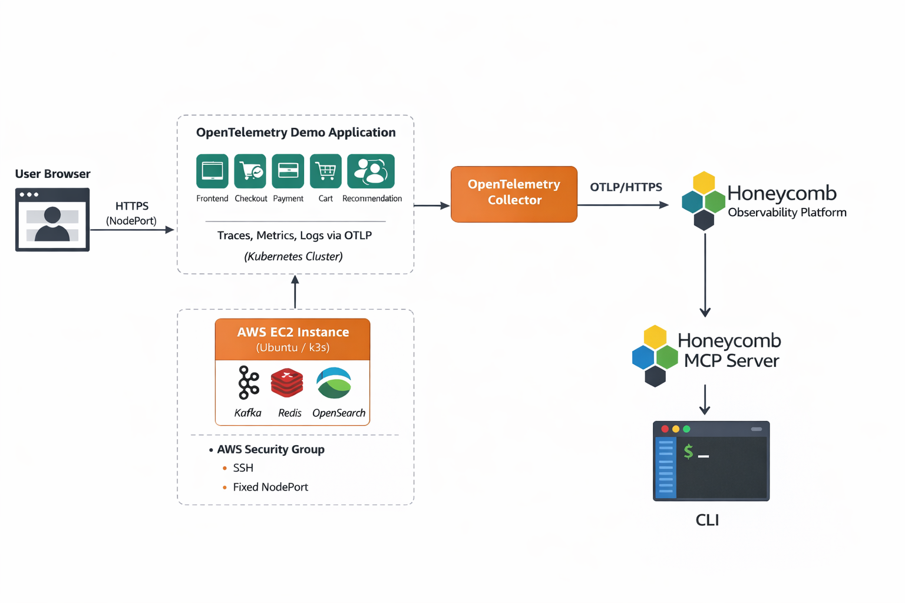

# 🚀 Intelligent SRE Platform with OpenTelemetry & Honeycomb

## 📌 Overview
This project demonstrates a **production-grade observability platform**
built on **Kubernetes** using **OpenTelemetry** and **Honeycomb**.

It simulates a real-world **microservices environment** and exports
**logs, metrics, and traces** securely to Honeycomb through a **single,
centralized OpenTelemetry Collector**, following modern SRE best practices.

The platform is deployed on **AWS EC2** and focuses on **security,
correctness, and operational reliability** rather than demo-only defaults.

---

## 🏗️ System Architecture

  

## 🧩 Core Components
- **AWS EC2 (Ubuntu)** – Infrastructure layer hosting the Kubernetes cluster  
- **K3s Kubernetes Cluster** – Lightweight, production-grade Kubernetes distribution  
- **OpenTelemetry Demo Microservices** – Realistic distributed microservices system  
- **OpenTelemetry Collector** – Single, centralized telemetry pipeline for logs, metrics, and traces  
- **Honeycomb** – Observability backend for high-cardinality debugging and analysis  
- **AWS Security Groups** – Network-level access control for UI and outbound telemetry  
- **NodePort UI Exposure** – Stable external access to the demo frontend

### Architecture Highlights
- User traffic enters via a **fixed Kubernetes NodePort**
- Microservices emit telemetry using **OpenTelemetry (OTLP)**
- A **single OpenTelemetry Collector** processes all telemetry
- Data is exported securely to **Honeycomb over OTLP/HTTPS (443)**
- **Honeycomb MCP** enables CLI and IDE-based querying

---

## ✨ Key Features
- ✅ Single-collector architecture (production best practice)
- 🔐 OTLP over HTTPS (443) – no inbound telemetry ports required
- 🚫 Demo exporters removed (Prometheus, OpenSearch, Jaeger exporters)
- 🔑 Kubernetes Secrets for Honeycomb API keys
- 🌐 Permanent NodePort exposure with AWS Security Groups
- 🧠 Honeycomb MCP support for CLI & IDE querying
- 🛠️ Scripted, repeatable infrastructure setup

---

## 📚 Documentation

- **ARCHITECTURE.md** – High-level system design and data flow explanation  
- **AWS-SETUP.md** – EC2 creation, instance sizing, storage, and networking  
- **PUTTY-SSH-SETUP.md** – Windows SSH access using PuTTY and `.ppk` keys  
- **K3S-SETUP.md** – Kubernetes (k3s) installation and validation  
- **OTEL-DEMO-DEPLOYMENT.md** – OpenTelemetry demo microservices deployment  
- **OTEL-COLLECTOR-HONEYCOMB.md** – Central collector configuration and Honeycomb export  
- **HONEYCOMB-MCP.md** – Honeycomb MCP server usage in CLI and IDEs  
- **UI-EXPOSURE-NODEPORT.md** – Permanent NodePort setup and AWS Security Groups  
- **SECURITY.md** – Secrets management, TLS, and network hardening  
- **TROUBLESHOOTING.md** – Real production issues encountered and fixes  
- **LESSONS-LEARNED.md** – SRE insights, mistakes, and best practices  

---

## 🎯 Project Goal
To demonstrate **real SRE and Cloud Engineering practices**, including:
- Correct OpenTelemetry architecture design
- Secure telemetry export to a SaaS observability backend
- Kubernetes networking and access control on AWS
- Practical debugging using Honeycomb and MCP tooling

This project reflects **production-level thinking**, not tutorial shortcuts.

---

